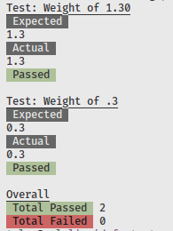
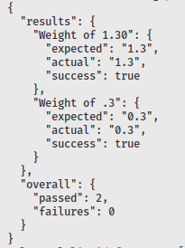

# Liquid Function Tester

Designed as a boilerplate to test snippets. Allowing you to define a test suite to test your snippet results.

How it works:

1. Dynamically creates a page on the Shopify store called `liquid-fn-test` with a page template assigned to it
2. For each test case, a dynamically created page template with the snippet setup is included
3. Store URL containing the dynamically created page is then fetched
4. Fetched page content is compared against expected result
5. Results are outputted to the terminal
6. Cleanup of page templates

Because it runs _on_ the Shopify store, any Liquid will be in the context of the shop including all variables (local, `all_products`, `product`, `request`, etc).

## Installation

### Docker

`docker build -t liquid_fn .` to build the image.

See _Creating a test_ section for next steps.

### Manual

`npm install` to install dependencies.

See _Creating a test_ section for next steps.

## Creating a test

### 1. Snippet

Place your snippet into the `tests` directory.

### 2. Test

Copy the `tests/example.js` file and rename it to the same as your snippet's name. For example: If your snippet is called `monkey.liquid`, then create a test file called `monkey.js`.

Modify the contents of the newly created test file to suit your testing needs.

#### Setup & Teardown

If you would like to extend the setup or teardown methods with your own code, you can do so as such:

```js
class Example {
  // ...

  async setup() {
    await super.setup();
    // your code
  }

  async teardown() {
    await super.teardown();
    // your code
  }

  // ...
}
```

## Running

Three items are required for running a test:

1. Publicly accessible store (not behind password)
2. An access token with ability to `read_themes` and `write_themes`
3. A theme's ID to modify assets

### Docker

`docker run -it -v .:/app:z liquid_fn node index.js -shop=(shop) -token=(token) -theme=(theme_id) -entry=(test_name) [-presenter=(presenter)]`

Example: `docker run -it -v .:/app:z liquid_fn node index.js -shop=someone.myshopify.com -token=89yurui389389ryiuriuu488 -theme=89389838 -entry=example`.

### Manual

`node index.js -shop=(shop) -token=(token) -theme=(theme_id) -entry=(test_name) [-presenter=(presenter)]`

Example: `node index.js -shop=someone.myshopify.com -token=89yurui389389ryiuriuu488 -theme=89389838 -entry=example`

## Events

Several events are executed during the test suite's run. You have the ability to tap into any of these events or even define your own. The [example test](./tests/example.js) shows how you can utilize the `setup` function to define events to listen for. Each event may pass in an object (details) to your listener.

### API

* `on([event_name(s)], [handler])`
  * Adds `[handler]` to listen to the `[event_name(s)]`.
* `off([event_name(s)], [handler])`
  * Removes `[handler]` from `[event_name(s)]`
* `once([event_name(s)], [handler])`
  * Adds `[handler]` to listen to the `[event_name(s)]`, fired only once.
* `emit([event_name], [details])`
  * Fires event with a name of `[event_name]` and passed `[details]` to handlers.

### Built-in

* `setup:start`: When `setup` is called. Details:
  * None
* `setup:end`: When `setup` has ran successfully. Details:
  * Response from page creation
  * Response from snippet creation
* `setup:failure`: When `setup` failed. Detail:
  * Error object
* `liquid-load:start`: Attempt to load the snippet contents. Details:
  * File path of snippet, to attempt reading
* `liquid-load:end`: When snippet was successfully read. Details:
  * File path of snippet
* `liquid-load:failure`: When snippet failed to be read. Details:
  * Error object
* `teardown:start`: When `teardown` is called. Details:
  * None
* `teardown:end`: When `teardown` has ran successfully. Details:
  * Responses from deleting page templates
* `teardown:failure`: When `teardown` has failed. Details:
  * Error object
* `render:start`: When `render` is called. Details:
  * Liquid setup code
  * Delay value
* `render:end`: When rendering ran successfully. Details:
  * HTTP text response from render call
* `render:retry`: When page fetch received HTML content, should be no HTML doctype due to no layout. Details:
  * None
* `render:retry:failure`: When retry has also failed. Details:
  * None
* `render:suffix`: Suffix generated for the dynamic page template. Details:
  * Suffix string
* `assert:start`: Before an assertion is ran. Details:
  * Description of test
  * Assertion logic
  * Expected result
  * Actual result
* `assert:success`: After an assertion has ran successfully. Details:
  * Description of test
  * Assertion logic
  * Expected result
  * Actual result
* `assert:failure`: After an assertion has failed. Details:
  * Description of test
  * Assertion logic
  * Expected result
  * Actual result
  * Error object

## Examples

See [tests/example.liquid](./tests/example.liquid) and [tests/example.js](./tests/example.js).

Various methods of output presenters are supported; default is `console` with addition to `json` and `json-pretty`. Example output of both:

| Console | JSON |
| ------- | ---- |
|  |  |

## Misc.

**_Why NodeJS?_**

Previously attempted a similar setup with Ruby, since Shopify's Liquid library is a Ruby package (Gem).

While the implementation worked great, it had flaws of not being able to utilize Shopify data or Shopify's custom Liquid filters such as `asset_url`, `img_tag`, `money`, etc. which could lead to some snippets not producing a true rendered result to what it would on Shopify's servers.

Given the process to get a result of the snippet rendering, the tool really could've been developed in any language such as Go, or Python, etc. however, given majority of Shopify developers most likely know their way around Javascript, then it made sense to go down that path.

**_Why a new page for each test assertion?_**

Shopify now caches page content. So, by creating a new page for every test assertion, we can get around the issue of having a stale rendered output. Additionally, through previous research, where there was a single page template which got updated instead of newly created, the update to theme file would take a indeterminded amount of time to refresh on Shopify, thus giving us the issue again of stale reneded output.

Upon completion of the test suite, all created page templates on the theme are removed as part of cleanup.

## TODO

* Add a `Filter` service to allow for modifying data before sent to Shopify
